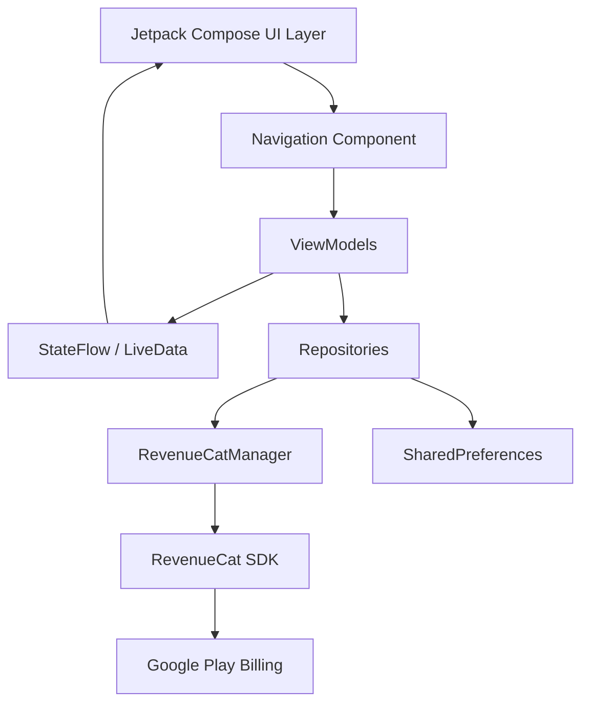
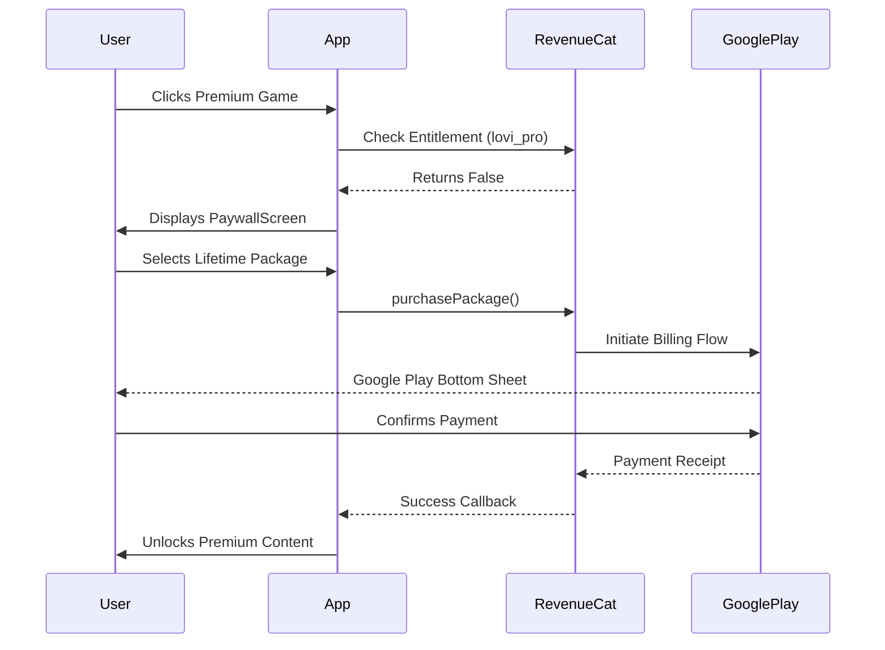

# LOVI

LOVI is an Android application designed to help children develop cognitive skills, attention span, and focus through engaging, interactive minigames. Built natively with Jetpack Compose, the application provides a seamless, fluid user experience with a premium subscription tier powered by RevenueCat.

## System Architecture

The application follows an MVVM (Model-View-ViewModel) architectural pattern combined with a Unidirectional Data Flow (UDF) approach for UI state management.



## Core Modules

### 1. Game Engine
A robust set of interactive screens tailored for cognitive development. Each game measures response time, accuracy, and progression.

| Game Name | Cognitive Focus | Access Level |
|-----------|-----------------|--------------|
| Wait For It (Catch the Bear) | Impulse Control | Free |
| Sequence Repeat | Working Memory | Free |
| What's Missing | Visual Memory | Free |
| Rule Switch Sort | Cognitive Flexibility | Premium |
| Find the Signal | Selective Attention | Premium |
| Watch the Firefly | Sustained Attention | Premium |

### 2. Monetization Layer (RevenueCat)
The application utilizes RevenueCat for managing Google Play subscriptions and one-time lifetime purchases.



## Directory Structure

```text
app/src/main/java/com/example/focusbuilder/
├── billing/
│   └── RevenueCatManager.kt      # Singleton managing RevenueCat configuration and state flows
├── navigation/
│   └── AppNavigation.kt          # Jetpack Compose NavHost and route definitions
├── ui/
│   ├── HomeScreen.kt             # Main dashboard and game selection
│   ├── PaywallScreen.kt          # Dynamic subscription UI rendering RevenueCat offerings
│   ├── GameCompleteScreen.kt     # Post-game statistics and progression
│   ├── GameIntroScreen.kt        # Pre-game instructions
│   └── (Game Screens)            # Individual Compose screens for the 6 minigames
```

## Technical Specifications

* **Language:** Kotlin
* **UI Framework:** Jetpack Compose (Material Design 3)
* **Minimum SDK:** API 26 (Android 8.0)
* **Target SDK:** API 34 (Android 14)
* **In-App Billing:** RevenueCat SDK (Google Play Store mapping)
* **State Management:** Kotlin Coroutines & StateFlow

## Setup and Installation

1. Clone the repository.
2. Open the project in Android Studio.
3. Create a `local.properties` file in the root directory.
4. Add the following line to `local.properties`, replacing the placeholder with your actual RevenueCat Google Play Public API Key:
   `revenuecat.api.key=goog_YOUR_API_KEY_HERE`
5. Sync project with Gradle files.
6. Select the `debug` or `release` variant and build the application.

*Note: To test the RevenueCat Paywall locally using the release variant, ensure you have configured `keystore.properties` with your official signing certificates, as Google Play Billing strictly enforces signature validation.*
